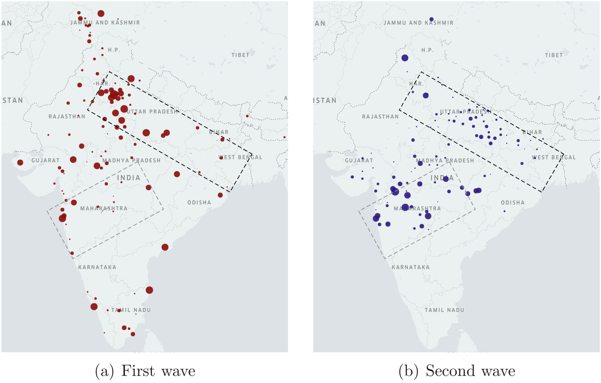
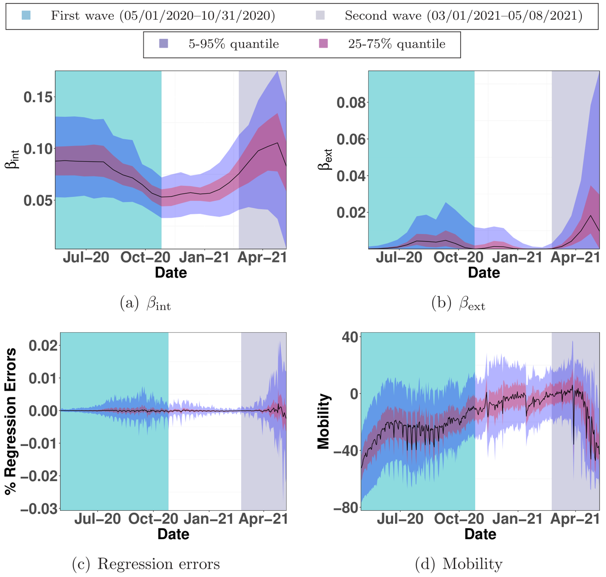

```{r setup, include=FALSE}
knitr::opts_chunk$set(echo = FALSE)

## To run all regression or only read figures
## if_run_regression_or_read_figure = TRUE 
if_run_regression_or_read_figure = FALSE
library(tidyverse)
library(lubridate)
library(zoo)
library(scales)
library(ggpubr)
library(knitr)
library(readxl)
library(readr)
library(data.table)
library(magrittr)
library(glmnet)
```

India experienced a rapid surge in COVID-19 infections during March-April 2021 that overwhelmed the healthcare system. This paper shows that the circulation of the Delta variant of the SARS-CoV-2 virus, amplified by a super-spreader event, likely caused India’s second wave. We analyze publicly available district-wise data of COVID-19 infections in India over 2020 and 2021. We use a combination of time-series analysis, epidemiological modeling, and parameter estimation methods. The data shows that a super-spreader event (Kumbh Mela festival being the possible candidate) is probable responsible for circulating the highly transmissible B.1.617.2 (Delta) variant of the SARS-CoV-2 virus that caused India’s second wave. Thus, the Indian experience serves as a cautionary tale that calls for increased genomic sequencing to identify variants of concern and to regulate super-spreader events, while vaccination remains the only long-term solution.

The source code of the analysis presented here is in the R Markdown file [README.Rmd](/README.Rmd). Draft of paper is in [COVID19-India.pdf](/Docs/COVID19-India.pdf). The data is in [Data](/Data) folder. We obtained the data from [www.covid19india.org](https://www.covid19india.org/).

```{r}
model_df <- read.csv("Data/dfIndia_to_models_districts_with_Mobility_for_paper.csv") %>%
  mutate(Date = ymd(Date)) %>%
  filter(!(month(Date) == 4 & year(Date) == 2020)) %>%
  rename(delta = dI)

first_wave_df <- model_df %>%  
  filter(year(Date) == 2020, month(Date) %in% c(5,6,7))

second_wave_df <- model_df %>%  
  filter(year(Date) == 2021, month(Date) %in% c(3,4,5))
```

**Figure 1(a) shows the number of daily new COVID-19 cases for all states in India, smoothed via a 21-day moving average.** 

```{r Figure-1(a), echo=FALSE}
text_size = 25
model_df %>%
  group_by(District_ID) %>%
  mutate(rM=rollmean(delta, 21, na.pad=TRUE, align="right")) %>%
  group_by(Date, State) %>%
  summarise(new_cases = sum(rM), .groups = "keep") %>%
  mutate(new_cases = new_cases / 1000) %>%
  ggplot(aes(x=Date,y=new_cases,colour=State,group=State)) + geom_line(size=1, na.rm = TRUE) + theme_bw() + theme(legend.position="none") +
  annotate("text", fontface = "bold", x = as.Date("2021-01-19"), y = 20, label = "Kerala", color = "black", size = 8.6) +  
  annotate("segment", x = as.Date("2021-01-20"),xend= as.Date("2021-02-06"),y= 18,yend= 6.6,arrow=arrow(), color="black") +
  annotate("segment", x = as.Date("2021-03-02"),xend= as.Date("2021-04-05"),y= 50,yend= 39,arrow=arrow(), color="black") +
  annotate("text", fontface = "bold", x = as.Date("2021-02-10"), y = 53, label = "Maharashtra", color = "black", size = 8.6) +
  labs(x ="Date", y = "Daily New Cases (1K)") + theme(text = element_text(face="bold", size=text_size),
        axis.text.x = element_text(face="bold", size = text_size), axis.text.y = element_text(face="bold", size = text_size)) +
  scale_x_date(labels = date_format("%b-%y"))
```

**Figure 1(b) illustrates the number of districts with 5 or more cumulative new COVID-19 cases since the start dates of the two waves.**

```{r Figure-1(b), echo=FALSE, message = FALSE}
xtitle <- 'Days since the start of wave'

df1b <- 
  read_csv("Data/Figure1b.csv") %>% 
  rename('First' = first) %>% 
  rename('Second' = second) %>% 
  pivot_longer(cols = c(2,3), names_to = "Wave")

ytitle <- 'Number of Districts'
file_name <- "Number_of_districts_greater_5_v2"

df1b %>% 
  ggplot(aes(x = Day, y = value, colour = Wave)) +
  geom_line(aes(linetype = Wave), size = 1.2) + 
  theme_bw() + 
  theme(text = element_text(size = 18), legend.position = c(0.8, 0.2), axis.title = element_text(face="bold", size=17)) + 
  labs(x =xtitle, y = ytitle)
```

<!-- #### Tp% Box plot -->

```{r, warning=FALSE}
hitting_time_fun <- function(df) {
  wave_peak <- df %>%
    tail(1) %>%
    "$"(Confirmed)
  wave_start <- df %>%
    head(1) %>%
    "$"(Confirmed)
  start_date = df %>%
    head(1) %>%
    "$"(Date)
  wave_id_list = c()
  for (i in 1:9) {
    wave_peak_percent = (wave_peak - wave_start) * 0.1 * i
    id = findInterval(wave_peak_percent + wave_start, df %>% "$"(Confirmed))
    wave_id_list = c(wave_id_list, id)
  }
  df %>%
    mutate(id_n = row_number()) %>%
    filter(id_n %in% wave_id_list) %>%
    mutate(peak_id = row_number()) %>%
    mutate(peak_time = difftime(Date, start_date, units = "days")) %>%
    select(peak_time,peak_id)
}
```

```{r}
first_wave_peak_time = "2020-09-15"
first_raw <- first_wave_df %>%
  filter(Date <= first_wave_peak_time) %>%
  group_by(District_ID) %>%
  nest() %>%
  mutate(model = map(data, hitting_time_fun)) %>%
  unnest(model) %>%
  ungroup() %>%
  mutate(peak_time = as.numeric(peak_time))
```

```{r}
second_raw <- second_wave_df %>%
  group_by(District_ID) %>%
  nest() %>%
  mutate(model = map(data, hitting_time_fun)) %>%
  unnest(model) %>%
  ungroup() %>%
  mutate(peak_time = as.numeric(peak_time))
```


**Figure 2(a) portrays $T_{p\%}$  across 394 districts during the first wave.** 

```{r Figure-2(a)}
box_text_size = 25
first_raw %>%
  filter(peak_id < 6) %>%
  mutate(peak_id = as.factor(peak_id)) %>%
  ggplot(aes(x = peak_id, y = peak_time)) + geom_boxplot() + theme_bw() +
  theme(text = element_text(face="bold", size=35), axis.text.x = element_text(face="bold", size=box_text_size), axis.text.y = element_text(face="bold", size=box_text_size)) +
  labs(x ="p %", y =latex2exp::TeX(r'($T_{p%}$)')) +
  scale_x_discrete(labels=c("10", "20", "30", "40", "50")) + scale_y_continuous(limits = c(0, 100))
```

**Figure 2(b) portrays $T_{p\%}$ for the second wave.**

```{r Figure-2(b)}
box_text_size = 25
second_raw %>%
  filter(peak_id < 6) %>%
  mutate(peak_id = as.factor(peak_id)) %>%
  ggplot(aes(x = peak_id, y = peak_time)) + geom_boxplot() + theme_bw() +
  theme(text = element_text(face="bold", size=35), axis.text.x = element_text(face="bold", size=box_text_size), axis.text.y = element_text(face="bold", size=box_text_size)) +
  labs(x ="p %", y = latex2exp::TeX(r'($T_{p%}$)')) +
  scale_x_discrete(labels=c("10", "20", "30", "40", "50")) +
  scale_y_continuous(limits = c(0, 100), breaks=c(25, 50, 75, 100))
```


## Origins of the COVID-19 Waves in India

### Cross-covariance of time-series

Consider the sequence of new daily COVID-19 infections in district $i$ on day $t$ as $\rho^i_t$, where $t$ is measured as days since the start dates of each wave. Then, the cross-covariance function over $T$ time-periods is described by

$$
    \mathcal{C}(i,j; \kappa) := \frac{1}{T}\sum_{t=1}^T \left( \rho^i_t - \langle \rho^i\rangle \right) \left( \rho^j_{t+\kappa} - \langle \rho^j\rangle \right),
$$

where $\kappa$ denotes the time-shift of one time-series with respect to the other in calculating the covariance. Here, $\langle \rho^i\rangle$ and $\langle \rho^j\rangle$ compute the empirical means of the $T$-length time series $\rho^i$ and $\rho^j$, respectively. The value of $\kappa_\star(i, j)$ at which the covariance is maximized between the daily new infections in district $i$ and that in district $j$ denotes the number of days by which the infection pattern in district $j$ roughly lags the pattern in district $i$. We vary $\kappa$ in $[-30, 30]$ with $T=92$ days for the emergence of the first wave and $T=69$ days for the second wave to compute $\kappa_\star(i, j)$. 

A time-lag between the patterns of district $i$ and district $j$   does not imply that infected people from district  $i$ came in direct contact with people in district $j$ to drive the spread of COVID-19. However, consistent positive values of $\kappa_\star(i, j)$’s for multiple $j$’s suggests that district $i$ is an epicenter of the infection spread.

Figure 3 portrays a bubble plot of $\sum_{j=1}^N\kappa_\star(i, j)$  over those locations $i$ for which this sum is positive. A larger bubble indicates higher likelihood of a location being a source of the infection spread. Figure 3 reveals important differences between the likely epicenters of the two waves.


**Figure 3. Bubble plots of $\kappa_\star$ for districts that have $\kappa_\star >0$ for the first wave in (a) and the second wave in (b). The size of the bubble indicates the magnitude of $\kappa_\star$. The dotted areas identify Maharashtra and the Ganges belt.**

```{r Figure-3}

```

**Figure 4. Variation of average population of districts with cumulative number of 5 or more infections since the start of the waves as in Figure 1.**
Start dates of the two waves are 05/01/2020 and 03/01/2021.

```{r Figure-4, message = FALSE}
df5 <- 
  read_csv("Data/Figure4.csv") %>% 
  rename('First' = first) %>% 
  rename('Second' = second) %>% 
  pivot_longer(cols = c(2,3), names_to = "Wave")

ytitle <- 'Average Population (100,000)'
file_name <- "Average_Population_greater_5_v2"

df5 %>% 
  ggplot(aes(x = Day, y = value, colour = Wave)) +
  geom_line(aes(linetype = Wave), size = 1.2) + 
  theme_bw() + 
  theme(text = element_text(size = 18), legend.position = c(0.8, 0.8), axis.title = element_text(face="bold", size=17)) + 
  labs(x =xtitle, y = ytitle)
```


<!-- ```{r} -->
<!-- District_list <- model_df %>% -->
<!--   distinct(District_ID) %>% -->
<!--   "$"(District_ID) -->

<!-- nDistrict <- length(District_list) -->
<!-- ``` -->

<!-- ```{r} -->
<!-- get_max_ccf_k <- function(x, y, max_k) { -->
<!-- cbind(ccf(x,y,max_k, plot = FALSE)$acf, ccf(x,y,max_k, plot = FALSE)$lag) %>% -->
<!--   as.data.frame() %>% -->
<!--   as_tibble() %>% -->
<!--   rename(acf = V1, lag = V2) %>% -->
<!--   mutate(acf = abs (acf)) %>% -->
<!--   slice(which.max(acf)) %>% -->
<!--   "$"(lag) -->
<!-- } -->
<!-- ``` -->

<!-- ```{r} -->
<!-- corMat <- matrix(nrow = nDistrict, ncol = nDistrict) -->
<!-- for (i in seq_along(District_list)){ -->
<!--   for (j in seq_along(District_list)){ -->
<!--     #print(paste(i,j)) -->
<!--     ci <- first_wave_df %>% -->
<!--       filter(District_ID == District_list[i]) %>% -->
<!--       "$"(delta) -->

<!--     cj <- first_wave_df %>% -->
<!--       filter(District_ID == District_list[j]) %>% -->
<!--       "$"(delta) -->

<!--     corMat[i,j] <- get_max_ccf_k(ci, cj, 30) -->
<!--   } -->
<!-- } -->
<!-- ``` -->

<!-- ```{r} -->
<!-- corMat_second <- matrix(nrow = nDistrict, ncol = nDistrict) -->
<!-- for (i in seq_along(District_list)){ -->
<!--   for (j in seq_along(District_list)){ -->
<!--     #print(paste(i,j)) -->
<!--     ci <- second_wave_df %>% -->
<!--       filter(District_ID == District_list[i]) %>% -->
<!--       "$"(delta) -->

<!--     cj <- second_wave_df %>% -->
<!--       filter(District_ID == District_list[j]) %>% -->
<!--       "$"(delta) -->

<!--     corMat_second[i,j] <- get_max_ccf_k(ci, cj, 30) -->
<!--   } -->
<!-- } -->
<!-- ``` -->

<!-- ```{r} -->
<!-- heatmap(corMat) -->
<!-- ``` -->


<!-- ```{r} -->
<!-- heatmap(corMat_second) -->
<!-- ``` -->

## Epidemiological Model to Explain India’s Infection Dynamics
We consider an epidemiological diffusion model, estimate its parameters from the district-wise test results, and demonstrate lack of fit during the second wave. To this end, consider the susceptible-infected-removed (SIR) compartmental model, described by
$$
\begin{aligned}
  S^i(t+1) &= S^i(t) - \beta^i_{\text{int}}I^i(t)S^i(t) -  \beta^i_{\text{ext}}I^i_{\text{ext}}(t)S^i(t)\\
  I^i(t+1) &= I^i(t) + \beta^i_{\text{int}}I^i(t)S^i(t) +  \beta^i_{\text{ext}}I^i_{\text{ext}}(t)S^i(t) - \gamma I^i(t),\\
  R^i(t+1) &= R^i(t) + \gamma I^i(t),    
\end{aligned}
$$
where
$$I_{\text{ext}}^i(t) = \frac{\sum_{j:(j,i) \in \mathcal{G}}I^j(t)P^j}{\sum_{j:(j,i)\in \mathcal{G}}P^j}.$$

We use two sets of data–the cumulative fraction of COVID-19 cases $Q^i$ on $t=1$ in district $i$ and the fraction of new COVID-positive cases $\Delta^i(t)$ in district $i$ on days $t=1,\ldots,T$. Specifically, $Q^i$’s yield 

$$
    S^i(1) = 1 - Q^i, \ I^i(1) = (1-\gamma) Q^i, \ R^i(1) = \gamma Q^i,
$$
that are then propagated using $\Delta$'s via
$$
\begin{aligned}
    S^i(t+1) &= S^i(t) - \Delta^i(t),
    \\
    I^i(t+1) &= I^i(t) + \Delta^i(t) - \gamma I^i(t), \\
    R^i(t+1) &= R^i(t) + \gamma I^i(t).
\end{aligned}
$$
Regression:
$$
\begin{aligned}
    &\varphi\left({\beta}[1], \ldots, {\beta}[26]\right)
    \\
    &:= \sum_{i=1}^N \sum_{\tau=1}^{26} \sum_{t=14\tau - 13}^{14\tau} \left(\Delta^i(t) - \beta^{i}_{\textrm{int}}[\tau] I^i(t) S^i(t) 
    -  \beta^{i}_{\textrm{ext}}[\tau] I^i_{\textrm{ext}}(t) S^i(t) \right)^2
    \\
    & \quad + \lambda \sum_{\tau=1}^{25}
    \sum_{i=1}^{N} 
    \left[ \left({\beta}^i_\textrm{int}[\tau+1]) - {\beta}^i_\textrm{int}[\tau]) \right)^2 
    + \left({\beta}^i_\textrm{ext}[\tau+1]) - {\beta}^i_\textrm{ext}[\tau]) \right)^2
    \right]
    \\
    & \quad 
    + \rho \sum_{\tau=1}^{26} \sum_{i=1}^{N} \beta_\textrm{ext}[\tau]^2.
\end{aligned}
$$
Please see the paper for details. 

```{r}
if(if_run_regression_or_read_figure){
  distance_df <- read.csv("Data/df_distance.csv")
  airport_df <- read.csv("Data/District_Airport_Matched_Edges.csv")
  dis_cut_off <- 0.25
  Get_id_adj_list <- function(id) {
    airport_j_list <- airport_df %>%
      filter(id_i == id) %>%
      distinct(id_j) %>%
      pull(id_j)
    airport_i_list <- airport_df %>%
      filter(id_j == id) %>%
      distinct(id_i) %>%
      pull(id_i)
    distance_adj_list <- distance_df %>%
      filter(d < dis_cut_off, id_j == id) %>%
      pull(id_i)
  
    adj_list <- setdiff(unique(c(airport_j_list, airport_i_list, distance_adj_list)), id)
    #adj_list <- setdiff(unique(distance_adj_list), id)
  }
  
  id_dataframe <-  model_df %>%
    distinct(id) %>%
    mutate(adj_list = map(id, Get_id_adj_list))
  
  Get_beta_ext_x <- function(id, date, I, P) {
    adj_list <- id_dataframe[id,2][[1]]
    model_df %>%
      filter(Date == date) %>%
      filter(id %in% adj_list) %>%
      summarise(I_mean = weighted.mean(I, P)) %>%
      pull(I_mean)
  }
  
  model_with_x <-  model_df %>%
    mutate(beta_null_x = (I * S) / (P^2)) %>%
    mutate(delta = delta / P) %>%
    mutate(beta_ext_x = pmap(list(id, Date, I, P), Get_beta_ext_x) %>% unlist()) %>%
    mutate(beta_ext_x = (beta_ext_x/P) * (S/P))
}
```

```{r}
method = "glmnet"

id_list = model_df$id %>% unique()

num_block = 25

num_obs = model_df$Date %>% unique() %>% length()

sir_text_size = 15

alpha_value = 0.3

first_wave_end = "2020-10-26" ## block end closest to 10.31

second_wave_start = "2021-02-23"

color_palette <- c("#8DDBE0", "white", "#D3D2E4")

beta_estimation_pipeline <- function(lambda, lambda2) {

  beta_estimation_list = as.data.frame(list(-1,-1, "2020-04-27", -1,-1), col.names= c("id","block_id", "date", "beta_null","beta_ext"))

  final_model_df <-
    model_with_x %>%
    mutate(Date = as.character(Date)) %>%  
    mutate(resid = 0)

  for (i in seq_along(id_list)){
    df_i <- model_with_x %>%
      mutate(Date = as.character(Date)) %>%  
      filter(id == i) %>%
      mutate(block_id = (row_number() %/% 15 + 1)) %>%
      select(block_id, Date, delta, beta_null_x, beta_ext_x)

    block_list <- df_i$block_id
    for (j in 1:num_block) {
      df_i[[paste("beta_null_x_", j, sep = "")]] <- ifelse(block_list == j, df_i$beta_null_x, 0)
      df_i[[paste("beta_ext_x_", j, sep = "")]] <- ifelse(block_list == j, df_i$beta_ext_x, 0)
    }
    df_f_i <- df_i %>%
      select(-c(beta_null_x, beta_ext_x, block_id, Date))

    row_num = (num_block-1)*2
    col_num = num_block*2+1
    mat_raw <- matrix(0, row_num, col_num)
    mat_raw_1 <- matrix(0, num_block, col_num)
    for (k in 1:row_num) {
      mat_raw[k, 1+k] = 1 * lambda
      mat_raw[k, 3+k] = -1 * lambda
    }
    for (u in 1:num_block){
      mat_raw_1[u, 2*u+1] = 1 * lambda2
    }
    mat_df <- mat_raw %>% as.data.frame()
    mat_1_df <- mat_raw_1 %>% as.data.frame()
    colnames(mat_df) <- colnames(df_f_i)
    colnames(mat_1_df) <- colnames(df_f_i)

    full_df <- rbind(df_f_i, mat_df, mat_1_df)
    if (method == "lm"){
      lm_model <- lm(delta ~ 0 + ., full_df)
      beta_estimate <- lm_model %>%
        tidy() %>%
        pull(estimate)
      resid_vec <- resid(lm_model) %>% as.vector() %>% head(num_obs)
    } else if (method == "glmnet"){
      glmnet_model <- glmnet(model.matrix(delta ~ 0 + ., full_df), as.matrix(full_df["delta"]), intercept=FALSE, lambda = rev(0:1), lower.limits = 0.0)
      resid_vec <- (full_df %>% pull(delta) - predict(glmnet_model, model.matrix(delta ~ 0 + ., full_df), s=0)) %>%
    as.vector()
      resid_vec <- resid_vec %>%
        head(num_obs)
      beta_estimate <- coef(glmnet_model, s=0) %>%
        as.vector() %>%
        tail(-1)
    }


    setDT(final_model_df)[id == i, resid := resid_vec]

    for (b in 1:num_block) {
      block_date <- df_i %>%
        filter(block_id == b) %>%
        slice(n()) %>%
        pull(Date)
      beta_estimation_row <- c(i, b, block_date, beta_estimate[2*b-1], beta_estimate[2*b])
      beta_estimation_list = rbind(beta_estimation_list, beta_estimation_row)
    }
  }

  ###### output and check with other model ##########


  plot_resid_quantile <- final_model_df %>%
    mutate(resid = resid * 100) %>%
    group_by(Date) %>%
    do(data.frame(t(quantile(.$resid, probs = c(0.05, 0.25, 0.5, 0.75, 0.95))))) %>%
    ggplot(aes(x = Date, group = 1)) + theme_bw() +
    geom_rect(aes(xmin = "2020-05-01", xmax = first_wave_end, ymin = -Inf, ymax = Inf), fill = color_palette[1], alpha = 0.1) +
    geom_rect(aes(xmin = first_wave_end, xmax = second_wave_start, ymin = -Inf, ymax = Inf), fill = color_palette[2], alpha = 0.1) +
    geom_rect(aes(xmin = second_wave_start, xmax = "2021-05-08", ymin = -Inf, ymax = Inf), fill = color_palette[3], alpha = 0.1) +
    geom_ribbon(aes(ymin = X5., ymax = X95., fill = "05%-95%"), alpha = alpha_value) +
    geom_ribbon(aes(ymin = X25., ymax = X75., fill = "25%-75%"), alpha = alpha_value) +
    geom_line(aes(y = X50.)) +
    scale_fill_manual(name = "", values = c("25%-75%" = "red", "05%-95%" = "blue")) +
    scale_x_discrete(breaks=c("2020-07-01", "2020-10-01", "2021-01-01", "2021-04-01"), labels=c("Jul-20","Oct-20","Jan-21","Apr-21")) +
    labs(x ="Date", y = "% Regression Errors") + theme(text = element_text(face="bold", size=sir_text_size),
          axis.text.x = element_text(face="bold", size = sir_text_size), axis.text.y = element_text(face="bold", size = sir_text_size)) + theme(legend.position="none") + theme(panel.background = element_rect(), panel.grid.major = element_line( colour = "white"))


  ###### Beta Ext ########
  beta_estimation_df <-
    beta_estimation_list %>%
    as_tibble() %>%
    tail(-1)


  beta_ext_all_plot_quantile <- beta_estimation_df %>%
    mutate_at(c("id","block_id", "beta_null","beta_ext"), as.numeric) %>%
    mutate(date = ymd(date)) %>%
    group_by(date) %>%
    do(data.frame(t(quantile(.$beta_ext, probs = c(0.05, 0.25, 0.5, 0.75, 0.95))))) %>%
    ggplot(aes(x = date, group = 1)) + theme_bw() +
    geom_rect(aes(xmin = "2020-05-14" %>% as.Date("%Y-%m-%d"), xmax = first_wave_end %>% as.Date("%Y-%m-%d"), ymin = -Inf, ymax = Inf), fill = color_palette[1], alpha = 0.1) +
    geom_rect(aes(xmin = first_wave_end %>% as.Date("%Y-%m-%d"), xmax = second_wave_start %>% as.Date("%Y-%m-%d"), ymin = -Inf, ymax = Inf), fill = color_palette[2], alpha = 0.1) +
    geom_rect(aes(xmin = second_wave_start %>% as.Date("%Y-%m-%d"), xmax = "2021-05-08" %>% as.Date("%Y-%m-%d"), ymin = -Inf, ymax = Inf), fill = color_palette[3], alpha = 0.1) +
    geom_ribbon(aes(ymin = X5., ymax = X95., fill = "05%-95%"), alpha = alpha_value) +
    geom_ribbon(aes(ymin = X25., ymax = X75., fill = "25%-75%"), alpha = alpha_value) +
    geom_line(aes(y = X50.)) +
    scale_fill_manual(name = "", values = c("25%-75%" = "red", "05%-95%" = "blue")) +
    labs(x ="Date", y = latex2exp::TeX(r'($\beta_{ext}$)')) + theme(text = element_text(face="bold", size=sir_text_size),
          axis.text.x = element_text(face="bold", size = sir_text_size), axis.text.y = element_text(face="bold", size = sir_text_size)) +
    theme(legend.position="none") +
    scale_x_date(expand = c(0, 0), labels = date_format("%b-%y")) + scale_y_continuous(expand = c(0, 0)) + theme(panel.background = element_rect(), panel.grid.major = element_line( colour = "white"))

   ####### Beta Int #######


  beta_int_all_plot_quantile <- beta_estimation_df %>%
    mutate_at(c("id","block_id", "beta_null","beta_ext"), as.numeric) %>%
    mutate(date = ymd(date)) %>%
    group_by(date) %>%
    do(data.frame(t(quantile(.$beta_null, probs = c(0.05, 0.25, 0.5, 0.75, 0.95))))) %>%
    ggplot(aes(x = date, group = 1)) + theme_bw() +
    geom_rect(aes(xmin = "2020-05-14" %>% as.Date("%Y-%m-%d"), xmax = first_wave_end %>% as.Date("%Y-%m-%d"), ymin = -Inf, ymax = Inf), fill = color_palette[1], alpha = 0.1) +
    geom_rect(aes(xmin = first_wave_end %>% as.Date("%Y-%m-%d"), xmax = second_wave_start %>% as.Date("%Y-%m-%d"), ymin = -Inf, ymax = Inf), fill = color_palette[2], alpha = 0.1) +
    geom_rect(aes(xmin = second_wave_start %>% as.Date("%Y-%m-%d"), xmax = "2021-05-08" %>% as.Date("%Y-%m-%d"), ymin = -Inf, ymax = Inf), fill = color_palette[3], alpha = 0.1) +
    geom_ribbon(aes(ymin = X5., ymax = X95., fill = "05%-95%"), alpha = alpha_value) +
    geom_ribbon(aes(ymin = X25., ymax = X75., fill = "25%-75%"), alpha = alpha_value) +
    geom_line(aes(y = X50.)) +
    scale_fill_manual(name = "", values = c("25%-75%" = "red", "05%-95%" = "blue")) +
    labs(x ="Date", y = latex2exp::TeX(r'($\beta_{int}$)')) + theme(text = element_text(face="bold", size=sir_text_size),
          axis.text.x = element_text(face="bold", size = sir_text_size), axis.text.y = element_text(face="bold", size = sir_text_size)) +
    theme(legend.position="none") +
    scale_x_date(expand = c(0, 0), labels = date_format("%b-%y")) + scale_y_continuous(expand = c(0, 0)) + theme(panel.background = element_rect(), panel.grid.major = element_line( colour = "white"))

  ####### mobility ######

  mob_plot <- final_model_df %>%
    filter(!is.na(Mob)) %>%
    group_by(Date) %>%
    do(data.frame(t(quantile(.$Mob, probs = c(0.05, 0.25, 0.5, 0.75, 0.95))))) %>%
    ggplot(aes(x = Date, group = 1)) + theme_bw() +
    geom_rect(aes(xmin = "2020-05-01", xmax = first_wave_end, ymin = -Inf, ymax = Inf), fill = color_palette[1], alpha = 0.1) +
    geom_rect(aes(xmin = first_wave_end, xmax = second_wave_start, ymin = -Inf, ymax = Inf), fill = color_palette[2], alpha = 0.1) +
    geom_rect(aes(xmin = second_wave_start, xmax = "2021-05-08", ymin = -Inf, ymax = Inf), fill = color_palette[3], alpha = 0.1) +
    geom_ribbon(aes(ymin = X5., ymax = X95., fill = "05%-95%"), alpha = alpha_value) +
    geom_ribbon(aes(ymin = X25., ymax = X75., fill = "25%-75%"), alpha = alpha_value) +
    geom_line(aes(y = X50.)) +
    scale_fill_manual(name = "", values = c("25%-75%" = "red", "05%-95%" = "blue")) +
    scale_x_discrete(breaks=c("2020-07-01", "2020-10-01", "2021-01-01", "2021-04-01"), labels=c("Jul-20","Oct-20","Jan-21","Apr-21")) +
    labs(x ="Date", y = "Mobility") + theme(text = element_text(face="bold", size=sir_text_size),
          axis.text.x = element_text(face="bold", size = sir_text_size), axis.text.y = element_text(face="bold", size = sir_text_size)) + theme(legend.position="none") + theme(panel.background = element_rect(),
                     panel.grid.major = element_line( colour = "white"))

    ####### egg put together #######
   return(ggarrange(beta_int_all_plot_quantile, mob_plot, beta_ext_all_plot_quantile, plot_resid_quantile, nrow = 2))
  
}
```

**Figure 5. Plots (a) and (b) capture the quantiles of  ’s and  ’s across districts over 2-week time windows from 05/01/2020 to 05/08/2021. The regression errors in explaining the emergence of daily new infections with the estimated β’s is given in (c). Plot (d) shows the quantiles of mobility variations across districts.**
text

```{r Figure-5}
if(if_run_regression_or_read_figure){
  l <- 1e-3
  exp <- 1e-3
  p <- beta_estimation_pipeline(l, ext)
}else{
  
}
```


