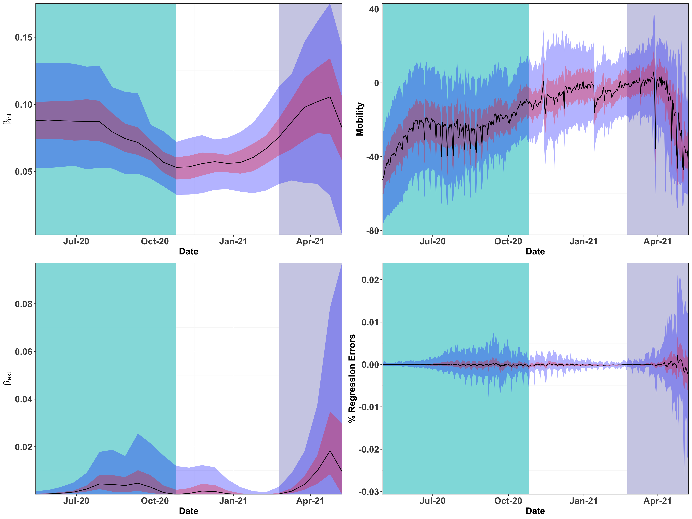

What Explains India’s Second Wave of COVID-19 Infections?
================

India experienced a rapid surge in COVID-19 infections during
March-April 2021 that overwhelmed the healthcare system. This paper
shows that the circulation of the Delta variant of the SARS-CoV-2 virus,
amplified by a super-spreader event, likely caused India’s second wave.
We analyze publicly available district-wise data of COVID-19 infections
in India over 2020 and 2021. We use a combination of time-series
analysis, epidemiological modeling, and parameter estimation methods.
The data shows that a super-spreader event (Kumbh Mela festival being
the possible candidate) is probable responsible for circulating the
highly transmissible B.1.617.2 (Delta) variant of the SARS-CoV-2 virus
that caused India’s second wave. Thus, the Indian experience serves as a
cautionary tale that calls for increased genomic sequencing to identify
variants of concern and to regulate super-spreader events, while
vaccination remains the only long-term solution.

The code of the analysis presented here in the R Markdown source file
[README.Rmd](/README.Rmd). Draft of paper is in
[COVID19-India.pdf](/COVID19-India.pdf). The data is in [Data](/Data)
folder. We obtained the data from
[www.covid19india.org](https://www.covid19india.org/).

**Figure 1. Plot (a) shows the number of daily new COVID-19 cases for
all states in India, smoothed via a 21-day moving average.**

-1.png)<!-- -->

<!-- #### Tp% Box plot -->

**Figure 2(a) portrays

across 394 districts during the first wave.**

-1.png)<!-- -->

**Figure 2(b) portrays the same for the second wave.**
-1.png)<!-- -->

## Origins of the COVID-19 Waves in India

<!-- ### Cross-covariance of time-series -->
<!-- ```{r} -->
<!-- District_list <- model_df %>% -->
<!--   distinct(District_ID) %>% -->
<!--   "$"(District_ID) -->
<!-- nDistrict <- length(District_list) -->
<!-- ``` -->
<!-- ```{r} -->
<!-- get_max_ccf_k <- function(x, y, max_k) { -->
<!-- cbind(ccf(x,y,max_k, plot = FALSE)$acf, ccf(x,y,max_k, plot = FALSE)$lag) %>% -->
<!--   as.data.frame() %>% -->
<!--   as_tibble() %>% -->
<!--   rename(acf = V1, lag = V2) %>% -->
<!--   mutate(acf = abs (acf)) %>% -->
<!--   slice(which.max(acf)) %>% -->
<!--   "$"(lag) -->
<!-- } -->
<!-- ``` -->
<!-- ```{r} -->
<!-- corMat <- matrix(nrow = nDistrict, ncol = nDistrict) -->
<!-- for (i in seq_along(District_list)){ -->
<!--   for (j in seq_along(District_list)){ -->
<!--     #print(paste(i,j)) -->
<!--     ci <- first_wave_df %>% -->
<!--       filter(District_ID == District_list[i]) %>% -->
<!--       "$"(delta) -->
<!--     cj <- first_wave_df %>% -->
<!--       filter(District_ID == District_list[j]) %>% -->
<!--       "$"(delta) -->
<!--     corMat[i,j] <- get_max_ccf_k(ci, cj, 30) -->
<!--   } -->
<!-- } -->
<!-- ``` -->
<!-- ```{r} -->
<!-- corMat_second <- matrix(nrow = nDistrict, ncol = nDistrict) -->
<!-- for (i in seq_along(District_list)){ -->
<!--   for (j in seq_along(District_list)){ -->
<!--     #print(paste(i,j)) -->
<!--     ci <- second_wave_df %>% -->
<!--       filter(District_ID == District_list[i]) %>% -->
<!--       "$"(delta) -->
<!--     cj <- second_wave_df %>% -->
<!--       filter(District_ID == District_list[j]) %>% -->
<!--       "$"(delta) -->
<!--     corMat_second[i,j] <- get_max_ccf_k(ci, cj, 30) -->
<!--   } -->
<!-- } -->
<!-- ``` -->
<!-- ```{r} -->
<!-- heatmap(corMat) -->
<!-- ``` -->
<!-- ```{r} -->
<!-- heatmap(corMat_second) -->
<!-- ``` -->

## Epidemiological Model to Explain India’s Infection Dynamics

We consider an epidemiological diffusion model, estimate its parameters
from the district-wise test results, and demonstrate lack of fit during
the second wave. To this end, consider the susceptible-infected-removed
(SIR) compartmental model, described by

 &= S^i(t) - \beta^i_{\text{int}}I^i(t)S^i(t) -  \beta^i_{\text{ext}}I^i_{\text{ext}}(t)S^i(t)\\
  I^i(t+1) &= I^i(t) + \beta^i_{\text{int}}I^i(t)S^i(t) +  \beta^i_{\text{ext}}I^i_{\text{ext}}(t)S^i(t) - \gamma I^i(t),\\
  R^i(t+1) &= R^i(t) + \gamma I^i(t),    
\end{aligned}
")

where

 = \frac{\sum_{j:(j,i) \in G}I^j(t)P^j}{\sum_{j:(j,i)\in G}P^j}.")

Please see paper for details.

**Figure 5. Plots (a) and (b) capture the quantiles of ’s and ’s across
districts over 2-week time windows from 05/01/2020 to 05/08/2021. The
regression errors in explaining the emergence of daily new infections
with the estimated β’s is given in (c). Plot (d) shows the quantiles of
mobility variations across districts.** text


