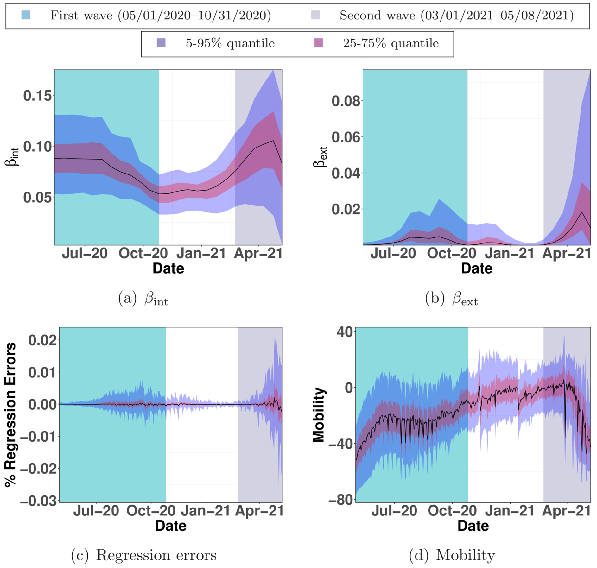

What Explains India’s Second Wave of COVID-19 Infections?
================

India experienced a rapid surge in COVID-19 infections during
March-April 2021 that overwhelmed the healthcare system. This paper
shows that the circulation of the Delta variant of the SARS-CoV-2 virus,
amplified by a super-spreader event, likely caused India’s second wave.
We analyze publicly available district-wise data of COVID-19 infections
in India over 2020 and 2021. We use a combination of time-series
analysis, epidemiological modeling, and parameter estimation methods.
The data shows that a super-spreader event (Kumbh Mela festival being
the possible candidate) is probable responsible for circulating the
highly transmissible B.1.617.2 (Delta) variant of the SARS-CoV-2 virus
that caused India’s second wave. Thus, the Indian experience serves as a
cautionary tale that calls for increased genomic sequencing to identify
variants of concern and to regulate super-spreader events, while
vaccination remains the only long-term solution.

The source code of the analysis presented here is in the R Markdown file
[README.Rmd](/README.Rmd). Draft of paper is in
[COVID19-India.pdf](/Docs/COVID19-India.pdf). The data is in
[Data](/Data) folder. We obtained the data from
[www.covid19india.org](https://www.covid19india.org/).

**Figure 1(a) shows the number of daily new COVID-19 cases for all
states in India, smoothed via a 21-day moving average.**

-1.png)<!-- -->

**Figure 1(b) illustrates the number of districts with 5 or more
cumulative new COVID-19 cases since the start dates of the two waves.**

-1.png)<!-- -->

<!-- #### Tp% Box plot -->

**Figure 2(a) portrays

across 394 districts during the first wave.**

-1.png)<!-- -->

**Figure 2(b) portrays

for the second wave.**

-1.png)<!-- -->

## Origins of the COVID-19 Waves in India

### Cross-covariance of time-series

Consider the sequence of new daily COVID-19 infections in district
 on day
 as
,
where  is measured as
days since the start dates of each wave. Then, the cross-covariance
function over 
time-periods is described by

 := \frac{1}{T}\sum_{t=1}^T \left( \rho^i_t - \langle \rho^i\rangle \right) \left( \rho^j_{t+\kappa} - \langle \rho^j\rangle \right),
")

where 
denotes the time-shift of one time-series with respect to the other in
calculating the covariance. Here,

and

compute the empirical means of the
-length time series
 and
,
respectively. The value of
")
at which the covariance is maximized between the daily new infections in
district  and that in
district  denotes the
number of days by which the infection pattern in district
 roughly lags the
pattern in district . We
vary 
in
![\[-30, 30\]](https://latex.codecogs.com/png.latex?%5B-30%2C%2030%5D "[-30, 30]")
with  days
for the emergence of the first wave and
 days for the
second wave to compute
").

A time-lag between the patterns of district
 and district
 does not imply that
infected people from district
 came in direct contact
with people in district 
to drive the spread of COVID-19. However, consistent positive values of
")’s
for multiple ’s suggests
that district  is an
epicenter of the infection spread.

Figure 3 portrays a bubble plot of
")
over those locations 
for which this sum is positive. A larger bubble indicates higher
likelihood of a location being a source of the infection spread. Figure
3 reveals important differences between the likely epicenters of the two
waves.

**Figure 3. Bubble plots of

for districts that have

for the first wave in (a) and the second wave in (b). The size of the
bubble indicates the magnitude of
.
The dotted areas identify Maharashtra and the Ganges belt.**


**Figure 4. Variation of average population of districts with cumulative
number of 5 or more infections since the start of the waves as in Figure
1.** Start dates of the two waves are 05/01/2020 and 03/01/2021.

<!-- -->

<!-- ```{r} -->
<!-- District_list <- model_df %>% -->
<!--   distinct(District_ID) %>% -->
<!--   "$"(District_ID) -->
<!-- nDistrict <- length(District_list) -->
<!-- ``` -->
<!-- ```{r} -->
<!-- get_max_ccf_k <- function(x, y, max_k) { -->
<!-- cbind(ccf(x,y,max_k, plot = FALSE)$acf, ccf(x,y,max_k, plot = FALSE)$lag) %>% -->
<!--   as.data.frame() %>% -->
<!--   as_tibble() %>% -->
<!--   rename(acf = V1, lag = V2) %>% -->
<!--   mutate(acf = abs (acf)) %>% -->
<!--   slice(which.max(acf)) %>% -->
<!--   "$"(lag) -->
<!-- } -->
<!-- ``` -->
<!-- ```{r} -->
<!-- corMat <- matrix(nrow = nDistrict, ncol = nDistrict) -->
<!-- for (i in seq_along(District_list)){ -->
<!--   for (j in seq_along(District_list)){ -->
<!--     #print(paste(i,j)) -->
<!--     ci <- first_wave_df %>% -->
<!--       filter(District_ID == District_list[i]) %>% -->
<!--       "$"(delta) -->
<!--     cj <- first_wave_df %>% -->
<!--       filter(District_ID == District_list[j]) %>% -->
<!--       "$"(delta) -->
<!--     corMat[i,j] <- get_max_ccf_k(ci, cj, 30) -->
<!--   } -->
<!-- } -->
<!-- ``` -->
<!-- ```{r} -->
<!-- corMat_second <- matrix(nrow = nDistrict, ncol = nDistrict) -->
<!-- for (i in seq_along(District_list)){ -->
<!--   for (j in seq_along(District_list)){ -->
<!--     #print(paste(i,j)) -->
<!--     ci <- second_wave_df %>% -->
<!--       filter(District_ID == District_list[i]) %>% -->
<!--       "$"(delta) -->
<!--     cj <- second_wave_df %>% -->
<!--       filter(District_ID == District_list[j]) %>% -->
<!--       "$"(delta) -->
<!--     corMat_second[i,j] <- get_max_ccf_k(ci, cj, 30) -->
<!--   } -->
<!-- } -->
<!-- ``` -->
<!-- ```{r} -->
<!-- heatmap(corMat) -->
<!-- ``` -->
<!-- ```{r} -->
<!-- heatmap(corMat_second) -->
<!-- ``` -->

## Epidemiological Model to Explain India’s Infection Dynamics

We consider an epidemiological diffusion model, estimate its parameters
from the district-wise test results, and demonstrate lack of fit during
the second wave. To this end, consider the susceptible-infected-removed
(SIR) compartmental model, described by

 &= S^i(t) - \beta^i_{\text{int}}I^i(t)S^i(t) -  \beta^i_{\text{ext}}I^i_{\text{ext}}(t)S^i(t)\\
  I^i(t+1) &= I^i(t) + \beta^i_{\text{int}}I^i(t)S^i(t) +  \beta^i_{\text{ext}}I^i_{\text{ext}}(t)S^i(t) - \gamma I^i(t),\\
  R^i(t+1) &= R^i(t) + \gamma I^i(t),    
\end{aligned}
")

where

 = \frac{\sum_{j:(j,i) \in \mathcal{G}}I^j(t)P^j}{\sum_{j:(j,i)\in \mathcal{G}}P^j}.")

We use two sets of data–the cumulative fraction of COVID-19 cases
 on
 in district
 and the fraction of new
COVID-positive cases
")
in district  on days
.
Specifically, ’s
yield

 = 1 - Q^i, \ I^i(1) = (1-\gamma) Q^i, \ R^i(1) = \gamma Q^i,
")

that are then propagated using
’s via

 &= S^i(t) - \Delta^i(t),
    \\
    I^i(t+1) &= I^i(t) + \Delta^i(t) - \gamma I^i(t), \\
    R^i(t+1) &= R^i(t) + \gamma I^i(t).
\end{aligned}
")

Regression:

![
\\begin{aligned}
    &\\varphi\\left({\\beta}\[1\], \\ldots, {\\beta}\[26\]\\right)
    \\\\
    &:= \\sum\_{i=1}^N \\sum\_{\\tau=1}^{26} \\sum\_{t=14\\tau - 13}^{14\\tau} \\left(\\Delta^i(t) - \\beta^{i}\_{\\textrm{int}}\[\\tau\] I^i(t) S^i(t) 
    -  \\beta^{i}\_{\\textrm{ext}}\[\\tau\] I^i\_{\\textrm{ext}}(t) S^i(t) \\right)^2
    \\\\
    & \\quad + \\lambda \\sum\_{\\tau=1}^{25}
    \\sum\_{i=1}^{N} 
    \\left\[ \\left({\\beta}^i\_\\textrm{int}\[\\tau+1\]) - {\\beta}^i\_\\textrm{int}\[\\tau\]) \\right)^2 
    + \\left({\\beta}^i\_\\textrm{ext}\[\\tau+1\]) - {\\beta}^i\_\\textrm{ext}\[\\tau\]) \\right)^2
    \\right\]
    \\\\
    & \\quad 
    + \\rho \\sum\_{\\tau=1}^{26} \\sum\_{i=1}^{N} \\beta\_\\textrm{ext}\[\\tau\]^2.
\\end{aligned}
](https://latex.codecogs.com/png.latex?%0A%5Cbegin%7Baligned%7D%0A%20%20%20%20%26%5Cvarphi%5Cleft%28%7B%5Cbeta%7D%5B1%5D%2C%20%5Cldots%2C%20%7B%5Cbeta%7D%5B26%5D%5Cright%29%0A%20%20%20%20%5C%5C%0A%20%20%20%20%26%3A%3D%20%5Csum_%7Bi%3D1%7D%5EN%20%5Csum_%7B%5Ctau%3D1%7D%5E%7B26%7D%20%5Csum_%7Bt%3D14%5Ctau%20-%2013%7D%5E%7B14%5Ctau%7D%20%5Cleft%28%5CDelta%5Ei%28t%29%20-%20%5Cbeta%5E%7Bi%7D_%7B%5Ctextrm%7Bint%7D%7D%5B%5Ctau%5D%20I%5Ei%28t%29%20S%5Ei%28t%29%20%0A%20%20%20%20-%20%20%5Cbeta%5E%7Bi%7D_%7B%5Ctextrm%7Bext%7D%7D%5B%5Ctau%5D%20I%5Ei_%7B%5Ctextrm%7Bext%7D%7D%28t%29%20S%5Ei%28t%29%20%5Cright%29%5E2%0A%20%20%20%20%5C%5C%0A%20%20%20%20%26%20%5Cquad%20%2B%20%5Clambda%20%5Csum_%7B%5Ctau%3D1%7D%5E%7B25%7D%0A%20%20%20%20%5Csum_%7Bi%3D1%7D%5E%7BN%7D%20%0A%20%20%20%20%5Cleft%5B%20%5Cleft%28%7B%5Cbeta%7D%5Ei_%5Ctextrm%7Bint%7D%5B%5Ctau%2B1%5D%29%20-%20%7B%5Cbeta%7D%5Ei_%5Ctextrm%7Bint%7D%5B%5Ctau%5D%29%20%5Cright%29%5E2%20%0A%20%20%20%20%2B%20%5Cleft%28%7B%5Cbeta%7D%5Ei_%5Ctextrm%7Bext%7D%5B%5Ctau%2B1%5D%29%20-%20%7B%5Cbeta%7D%5Ei_%5Ctextrm%7Bext%7D%5B%5Ctau%5D%29%20%5Cright%29%5E2%0A%20%20%20%20%5Cright%5D%0A%20%20%20%20%5C%5C%0A%20%20%20%20%26%20%5Cquad%20%0A%20%20%20%20%2B%20%5Crho%20%5Csum_%7B%5Ctau%3D1%7D%5E%7B26%7D%20%5Csum_%7Bi%3D1%7D%5E%7BN%7D%20%5Cbeta_%5Ctextrm%7Bext%7D%5B%5Ctau%5D%5E2.%0A%5Cend%7Baligned%7D%0A "
\begin{aligned}
    &\varphi\left({\beta}[1], \ldots, {\beta}[26]\right)
    \\
    &:= \sum_{i=1}^N \sum_{\tau=1}^{26} \sum_{t=14\tau - 13}^{14\tau} \left(\Delta^i(t) - \beta^{i}_{\textrm{int}}[\tau] I^i(t) S^i(t) 
    -  \beta^{i}_{\textrm{ext}}[\tau] I^i_{\textrm{ext}}(t) S^i(t) \right)^2
    \\
    & \quad + \lambda \sum_{\tau=1}^{25}
    \sum_{i=1}^{N} 
    \left[ \left({\beta}^i_\textrm{int}[\tau+1]) - {\beta}^i_\textrm{int}[\tau]) \right)^2 
    + \left({\beta}^i_\textrm{ext}[\tau+1]) - {\beta}^i_\textrm{ext}[\tau]) \right)^2
    \right]
    \\
    & \quad 
    + \rho \sum_{\tau=1}^{26} \sum_{i=1}^{N} \beta_\textrm{ext}[\tau]^2.
\end{aligned}
")

Please see the paper for details.

**Figure 5. Plots (a) and (b) capture the quantiles of ’s and ’s across
districts over 2-week time windows from 05/01/2020 to 05/08/2021. The
regression errors in explaining the emergence of daily new infections
with the estimated β’s is given in (c). Plot (d) shows the quantiles of
mobility variations across districts.** text


