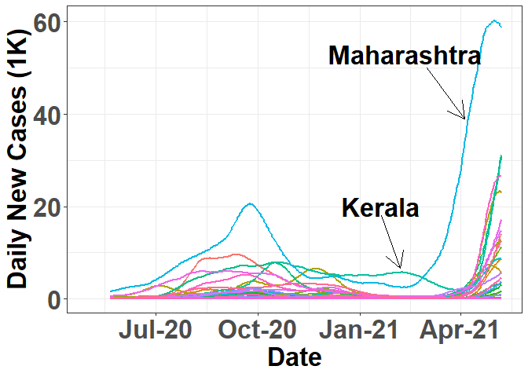
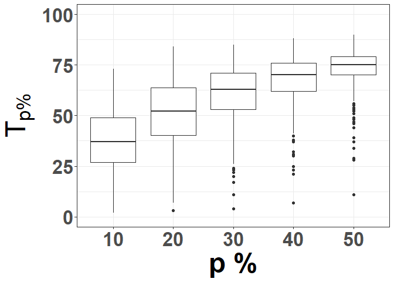
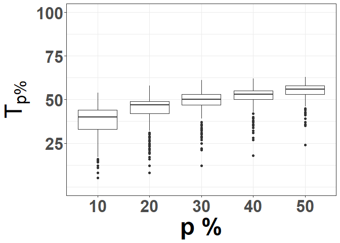
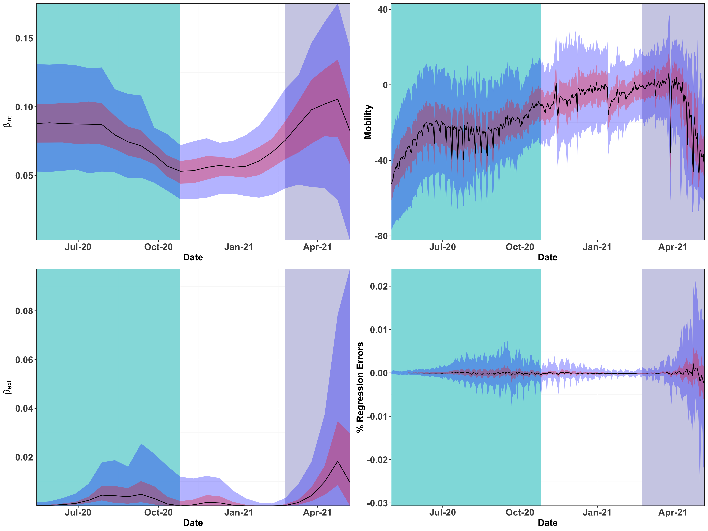

COVID19-India
================

## Dataset

## The Simultaneity of Infections in the Second Wave

### State time-series plot

<!-- -->

### Tp% Box plot

<!-- -->

<!-- -->

## Origins of the COVID-19 Waves in India

### Cross-covariance of time-series

<!-- ```{r} -->
<!-- District_list <- model_df %>% -->
<!--   distinct(District_ID) %>% -->
<!--   "$"(District_ID) -->
<!-- nDistrict <- length(District_list) -->
<!-- ``` -->
<!-- ```{r} -->
<!-- get_max_ccf_k <- function(x, y, max_k) { -->
<!-- cbind(ccf(x,y,max_k, plot = FALSE)$acf, ccf(x,y,max_k, plot = FALSE)$lag) %>% -->
<!--   as.data.frame() %>% -->
<!--   as_tibble() %>% -->
<!--   rename(acf = V1, lag = V2) %>% -->
<!--   mutate(acf = abs (acf)) %>% -->
<!--   slice(which.max(acf)) %>% -->
<!--   "$"(lag) -->
<!-- } -->
<!-- ``` -->
<!-- ```{r} -->
<!-- corMat <- matrix(nrow = nDistrict, ncol = nDistrict) -->
<!-- for (i in seq_along(District_list)){ -->
<!--   for (j in seq_along(District_list)){ -->
<!--     #print(paste(i,j)) -->
<!--     ci <- first_wave_df %>% -->
<!--       filter(District_ID == District_list[i]) %>% -->
<!--       "$"(delta) -->
<!--     cj <- first_wave_df %>% -->
<!--       filter(District_ID == District_list[j]) %>% -->
<!--       "$"(delta) -->
<!--     corMat[i,j] <- get_max_ccf_k(ci, cj, 30) -->
<!--   } -->
<!-- } -->
<!-- ``` -->
<!-- ```{r} -->
<!-- corMat_second <- matrix(nrow = nDistrict, ncol = nDistrict) -->
<!-- for (i in seq_along(District_list)){ -->
<!--   for (j in seq_along(District_list)){ -->
<!--     #print(paste(i,j)) -->
<!--     ci <- second_wave_df %>% -->
<!--       filter(District_ID == District_list[i]) %>% -->
<!--       "$"(delta) -->
<!--     cj <- second_wave_df %>% -->
<!--       filter(District_ID == District_list[j]) %>% -->
<!--       "$"(delta) -->
<!--     corMat_second[i,j] <- get_max_ccf_k(ci, cj, 30) -->
<!--   } -->
<!-- } -->
<!-- ``` -->
<!-- ```{r} -->
<!-- heatmap(corMat) -->
<!-- ``` -->
<!-- ```{r} -->
<!-- heatmap(corMat_second) -->
<!-- ``` -->

## Epidemiological Model to Explain India’s Infection Dynamics


